# Git非常基础入门
```flow
st=>start: 介绍基本概念
op1=>operation: 在路径下初始化仓库，正式开始版本控制
op2=>operation: 查看当前仓库的状态status
op3=>operation: add对仓库里面新出现的文件的改动进行追踪
op4=>operation: commit可以把文件的改动添加到主线

ed=>end: push推送到远程服务器

st->op1->op2->op3->op4->ed
```

# 创建一个新的仓库
`git init`在当前路径下初始化仓库，开始版本控制。
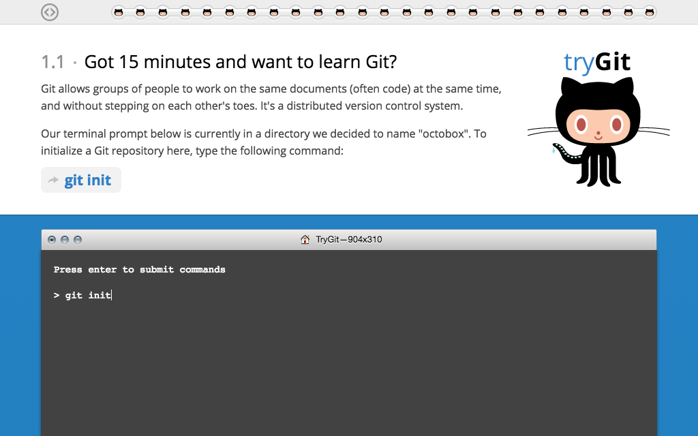
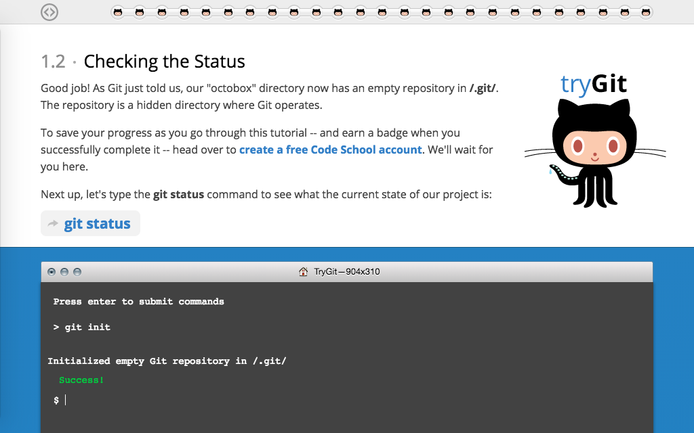
# 复制一个新的仓库
`git clone`可以克隆已经存在的仓库（本地或者远程）
比如克隆我远程服务器上面的仓库到本地就可以用
```
git clone https://github.com/chenlinlin6/Python_finance.git
```
# 查看当前状态
现在我们就在octobox初始化了一个仓库，这个仓库在`/.git/`这个隐藏文件夹下，我们可以通过`git status`来查看这个仓库的状态。
# 工作流
git仓库里面文件的修改和提交都有一套流程。

从一开始的工作路径，通过`git add`的方式创建仓库里面的索引，这个时候文件还在待定区还没有上传，通过commit之后才正式上传到了仓库里面。（但这个时候还在本地）HEAD指向你的最后一次上传的修改。
## add & commit
接下来，我们创建一个新的文件叫`octocat.txt`。然后再用`git status`查看当前状态。
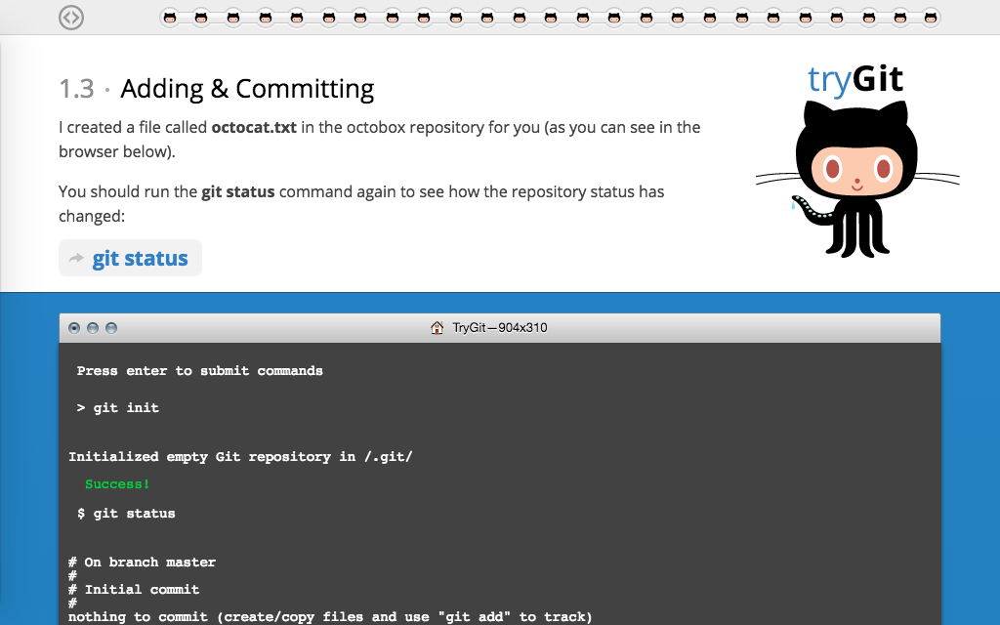
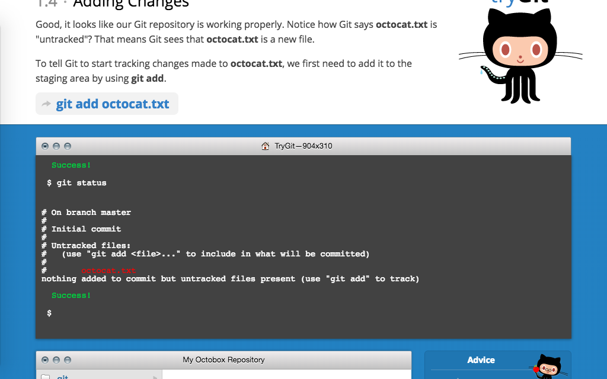
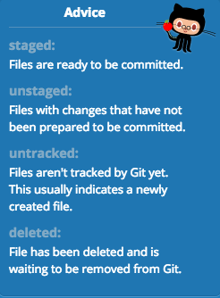
现在的`octocat.txt`是一个新的文件，它的变化不受仓库的追踪。新文件经过`git add`进入staging area，也就是待准备上传状态。而修改后的文件处于unstaged状态，也是通过`git add`进入准备上传状态staging area，然后commit上传。
`git add`的相反就是`git rm`
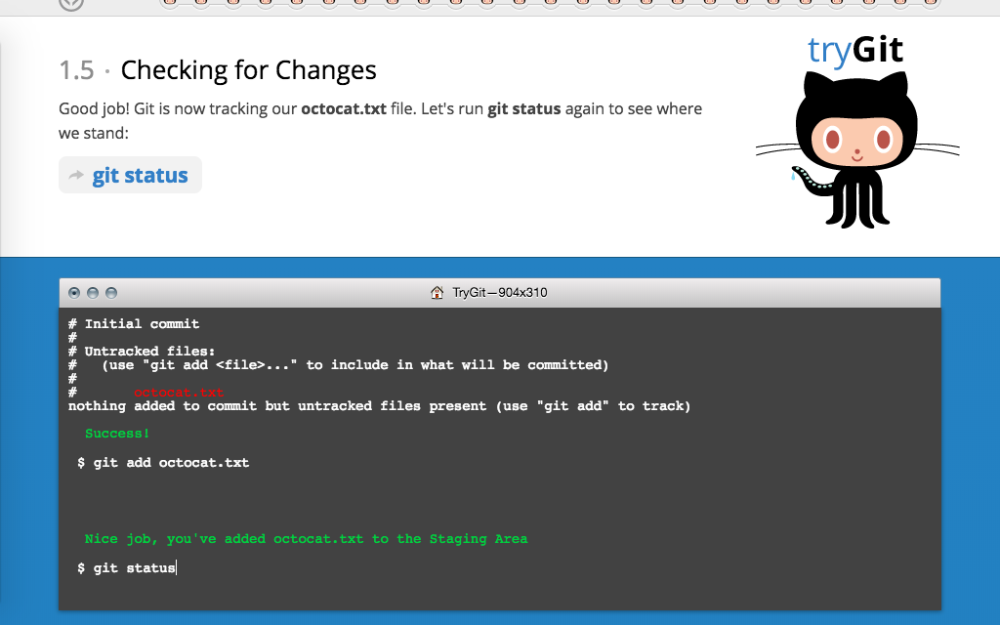
然后我们用`git status`查看下状态

`git commit -m "Add cute octocat story"`可以上传修改，-m后面添加修改信息。
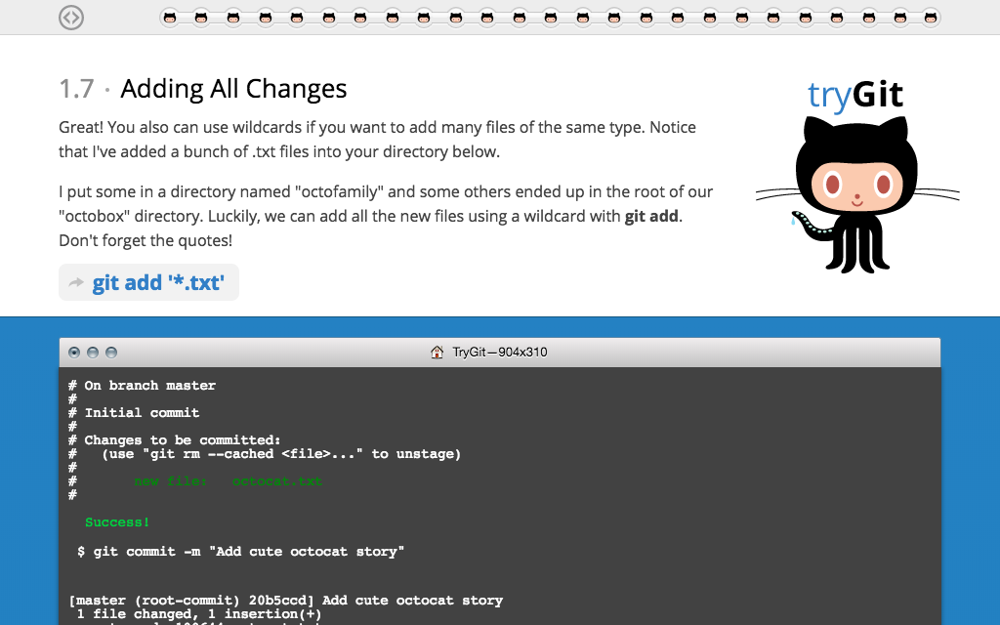
也可以用通配符进行批量添加到待上传区。
`git add ".txt"`
然后上传
`git commit -m "Add all the octocat txt files"`
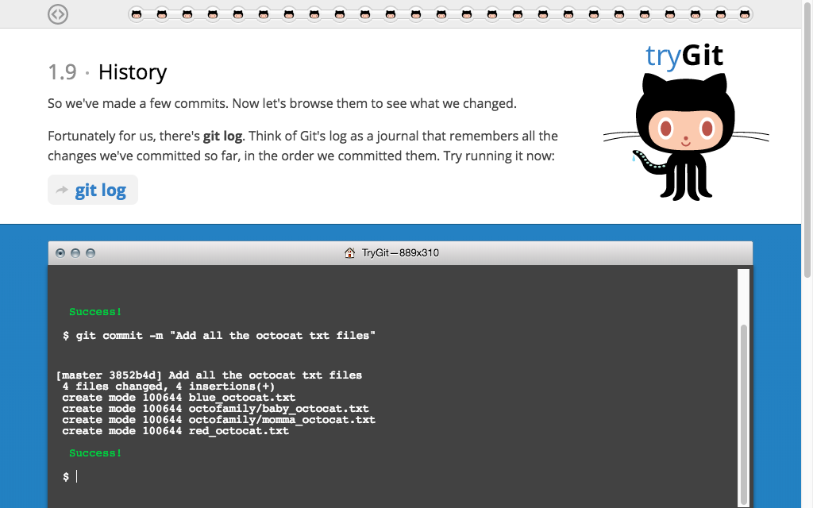
我们可以看到上传后返回的信息，接下来用`git log`的方法来看提交和删除的历史，可以用`git log -summary`查看更加详细的信息。
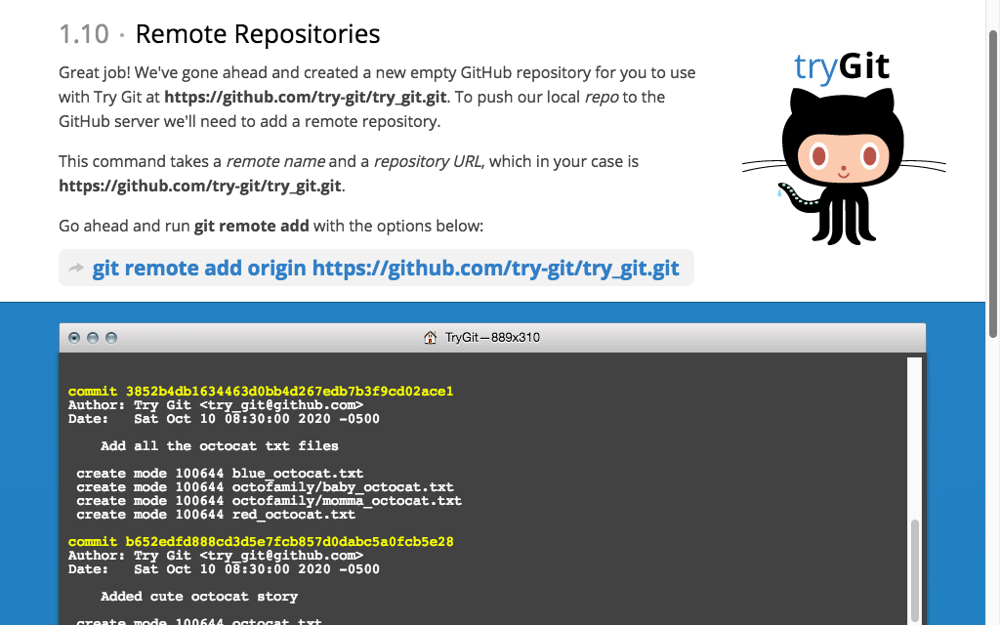
# 远程服务器操作
`git remote add origin url`
要将本地的文件push到远程，首先是要添加远程的仓库。用`git remote add`方法实现。关于如何在远程创建一个新的仓库，并将本地的仓库的改动push到远程可以参考git这篇[官方教程](https://help.github.com/articles/adding-an-existing-project-to-github-using-the-command-line/)。
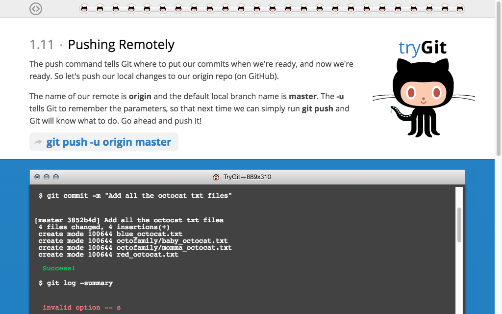
`git push origin master`
origin是远程服务器仓库的名字，也就是上面起的名字，master是本地创建仓库的时候默认起的名字。
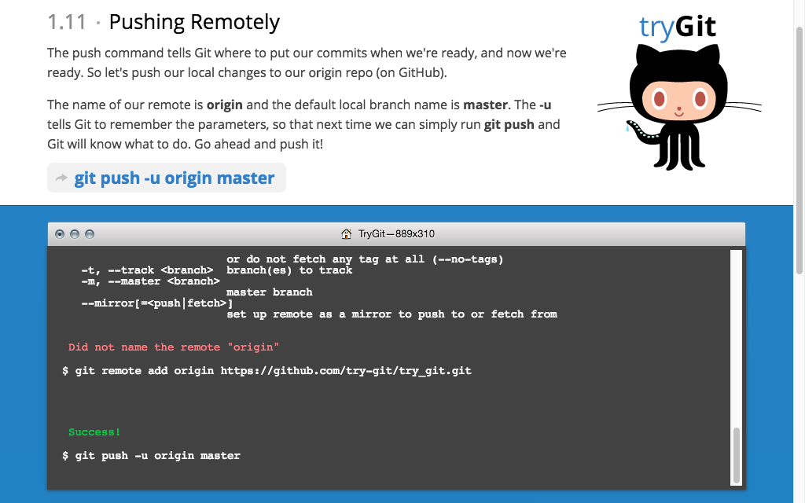
第一次push的时候要加参数-u后面跟上远程服务器仓库的名字和本地仓库的名字。
`git pull origin master`
是相反操作，把远程其他人提交的改变pull到本地
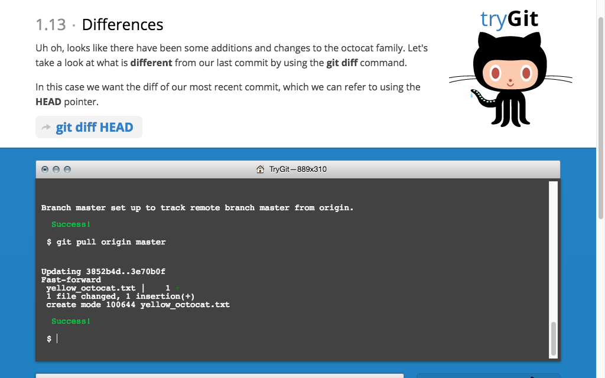
 `git diff HEAD`可以查看最近的改变情况，也就是距离我们最近一次提交的不同之处。
 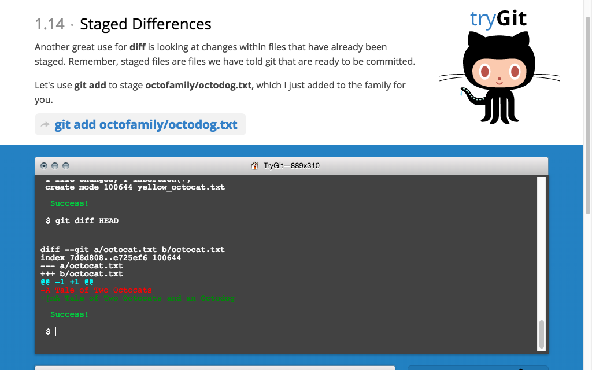
#  Branching

分支是用来协同合作的，相当于别人可以下载你的备份，然后做出修改后，push上去，如果你接受了改动，那就可以与原本的主线merge。
我们可以用`git checkout -b`的方法来创建并切换到新的分支。
```
git checkout -b feature_x
```
同样的，切换回主线
```
git checkout master
```
删除分支
```
git branch -d feature_x
```
如果我们想要查看一个方法怎么用，那你可以用`git checkout --help`的方法。
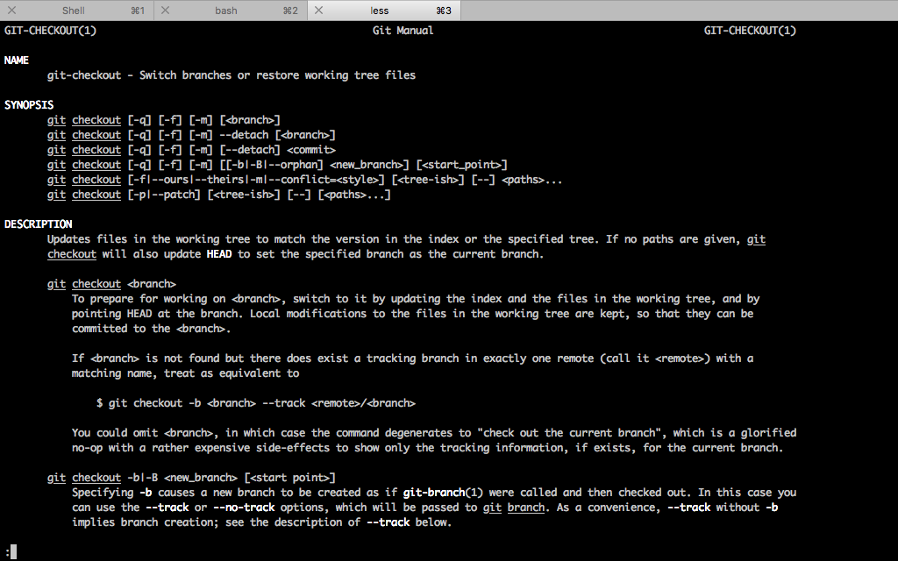
# 更新和合并
## Pull
`git pull`的方法可以将远程的改动更新到本地
## merge
`git merge`的方法可以将直线合并到当前你活动的支线（或者是主线）。
```
git merge <branch>
```
### diff
`git diff <source brance> <target branch>`可以查看
# 标签
`git tag`可以对commit进行标记，在软件开发有用。
比如
```
git tag 1.0.0 1b2e1d63ff 
```
 后面的是commit的log的前8位数字。
#  提交历史
`git log`查看提交历史。有很多参数

比如有查看提交作者为bob的，每一个信息用一行打印。
# 替换本地改变
`git fetch origin`可以获取远程服务器的改变
`git reset --hard origin/master`把本地的仓库作为远程服务器的分支。
# 参考资料
1. [git - the simple guide(个人觉得是最简洁明了的教程)](http://rogerdudler.github.io/git-guide/)
2. [try github(用来练手很不错)](https://try.github.io/levels/1/challenges/14)